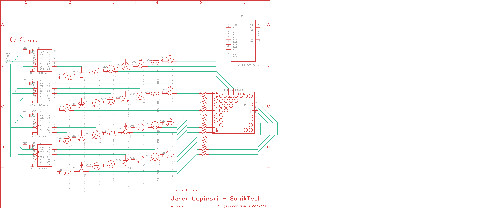

# 64-colorful-pixels
A cheap array of red, green, and blue dots

Work in progress: how to design the least expensive board that can drive those inexpensive 8x8 RGB LED arrays, with chaining and gif playback capability.

